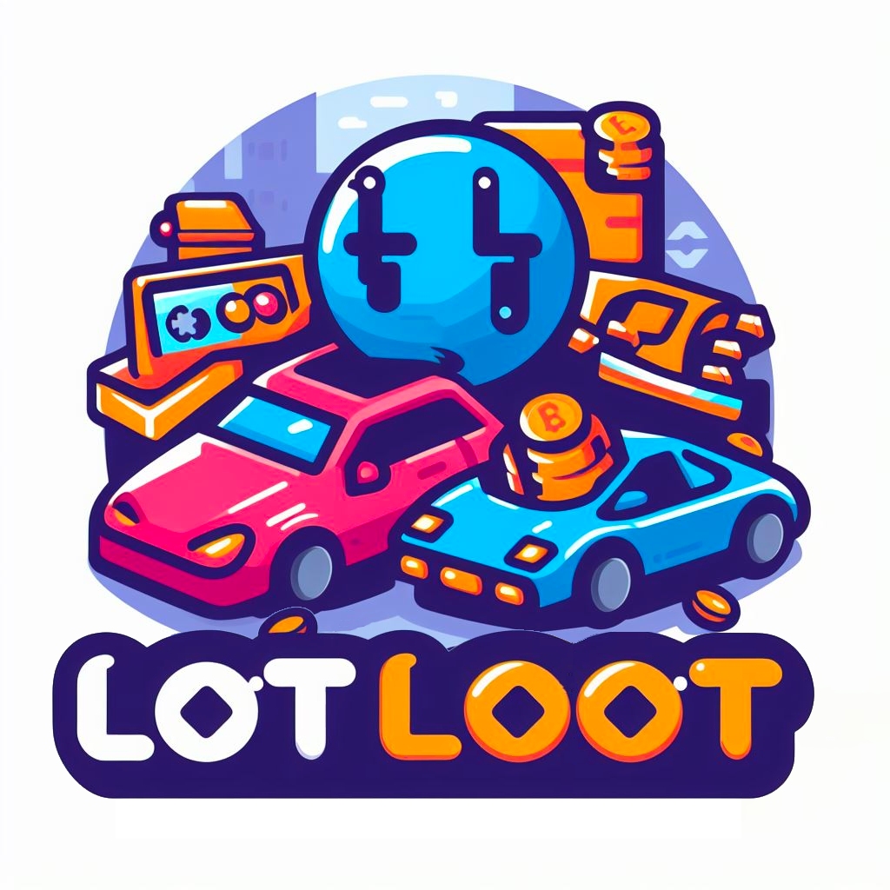

<h1>:parking:LotLoot:car:</h1>
<h3>A Fully On-Chain Game integrated with SocialFi</h3>

 

- 项目名称: LotLoot
- 所选赛道：Layer2 Application
- 项目图片
  - TODO 游戏截图
- 简介：LotLoot是一个基于区块链技术的社交抢车位游戏。玩家可以通过社交账号登录，拥有多辆车和5个车位，并与其他玩家互动，以获得代币收益。
  玩法：1. 账号注册与登录:
  用户需要使用社交账号（如Facebook, Twitter等）登录游戏；首次登录的用户将获得随机分配的3辆初始车辆和5个车位。
  2. 车位与车辆规则:
  每个玩家拥有5个车位，其中1个车位可以由玩家自己停放车辆，剩下的4个车位需由其他玩家停放车辆；每辆车停放在车位上时，根据车的品质，每秒都会产生一定数量的代币收益。收益的上限是24小时，之后需将车辆开走以提取收益；车辆的品质和收益率可以 
  通过消耗代币进行升级。
  3. 社交与互动:
  玩家可以查看好友的车位，决定是否将自己的车停放在好友的车位上；玩家也可以通过社交功能，邀请好友加入游戏，共同互动。
  4. 收益与罚单机制:
  车位的主人可以随时给自己车位上的车辆贴罚单，从而获取该车辆当前代币收入的90%，剩余的10%归车辆的主人所有；贴罚单后，车辆将被强制开走，车位重新变为可用状态。
  5. 升级机制:
  玩家可以通过消耗游戏内代币，提高自己车辆的品质和基础收益率；升级会影响车辆在车位上的代币产出速率，但不会影响24小时的收益上限。
  6. 市场与交易:
  玩家可以在游戏内的市场中，使用代币购买、出售或交换车辆和车位；市场交易将通过区块链技术确保交易的安全和透明。
  7. 排行榜与奖励:
  游戏将设有日、周、月排行榜，根据玩家的总收益、车位使用率等指标进行排名；排名靠前的玩家将获得额外的代币奖励和独家游戏道具。
  8. 未来扩展:
  游戏将不断推出新的车辆、车位和社交功能，以丰富游戏体验和增加玩家互动；通过LotLoot，玩家不仅可以享受游戏的乐趣，还能通过社交互动和策略选择，获得实质的代币收益。同时，区块链技术的应用，也将为玩家提供一个安全、公正、透明的游戏环境。
- 队长和队员：队长：队员：
- 本项目在这次黑客松的目标：实现LotLoot全链游戏从0到1开发，完成测试，聚合以太坊生态优质NFT，通过博弈方式，给予新赋能和应用。
- 黑客松前两日的进度
- Demo 视频链接（可以是录屏或其他形式），可以选择的视频平台：Youtube，Bilibili，Loom，视频长度不能超过3分钟，否则扣分。
- 项目 github repo 链接
- 声明未基于之前的项目: 该项目是本次hackathon期间，从0到1开发的项目，完全原创。
- 项目 Demo 链接（选填）
 
